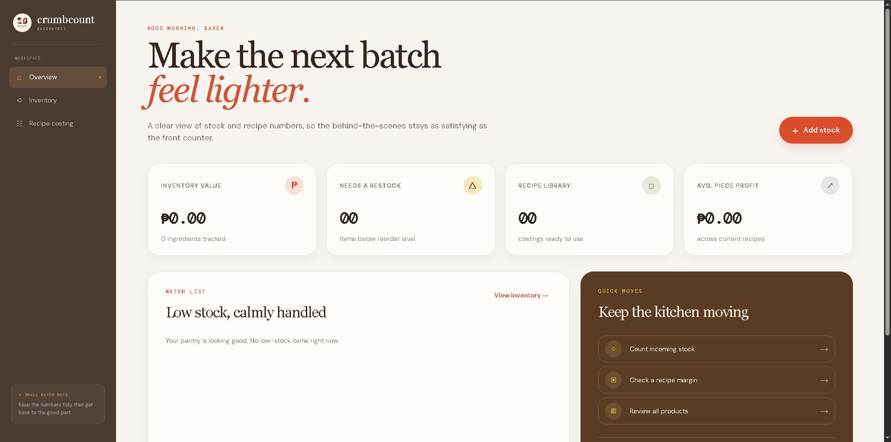
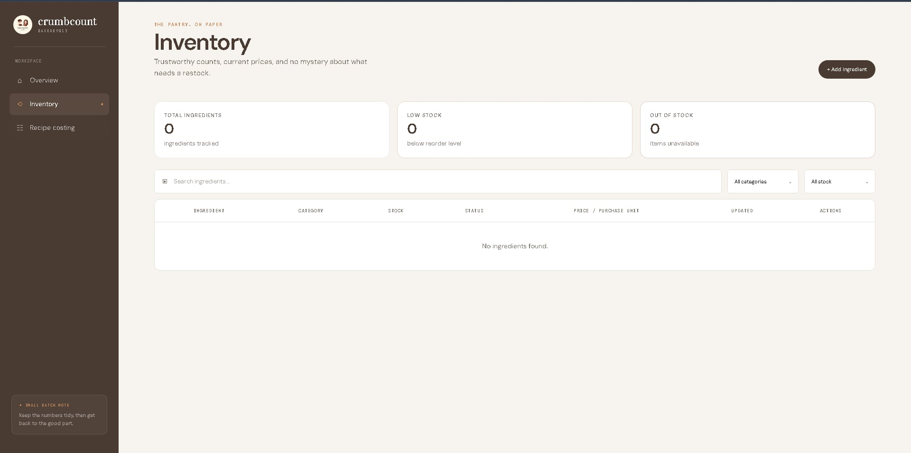
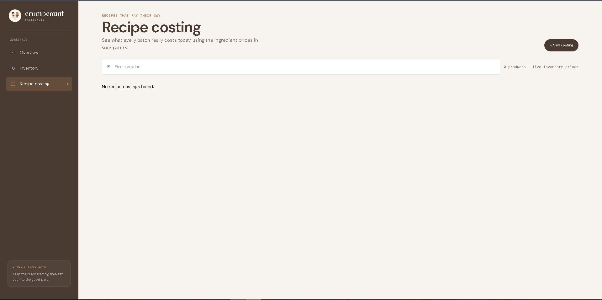
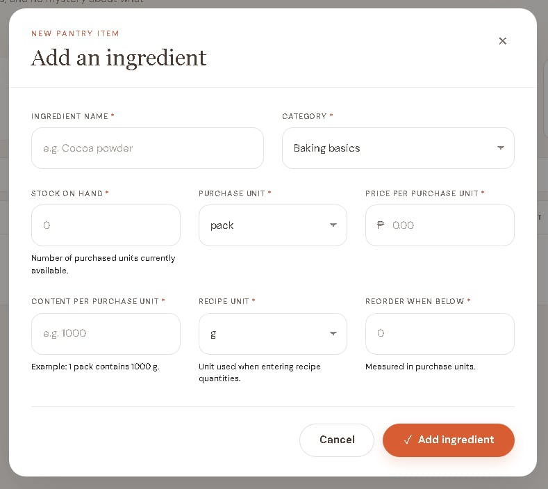
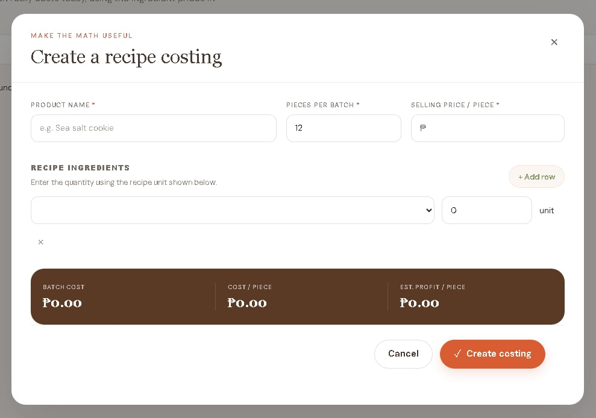
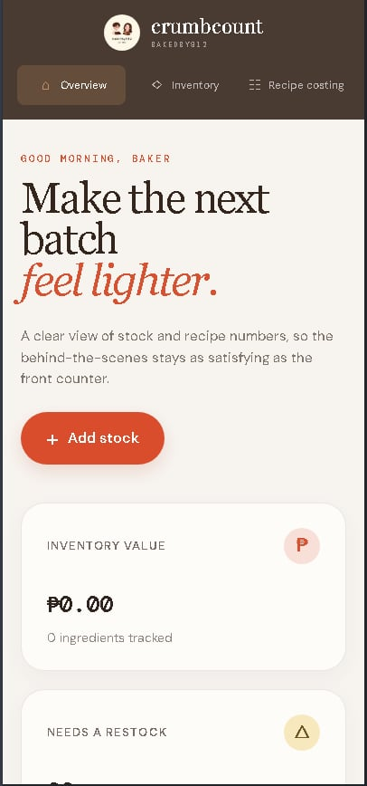
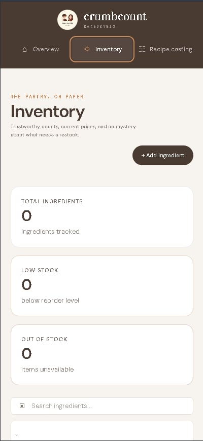
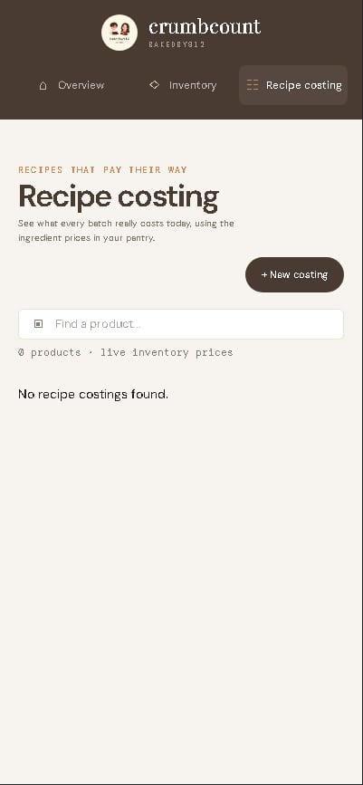
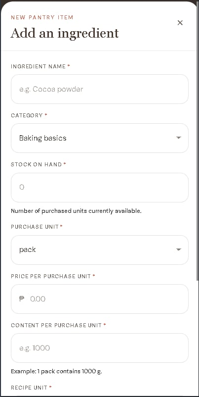
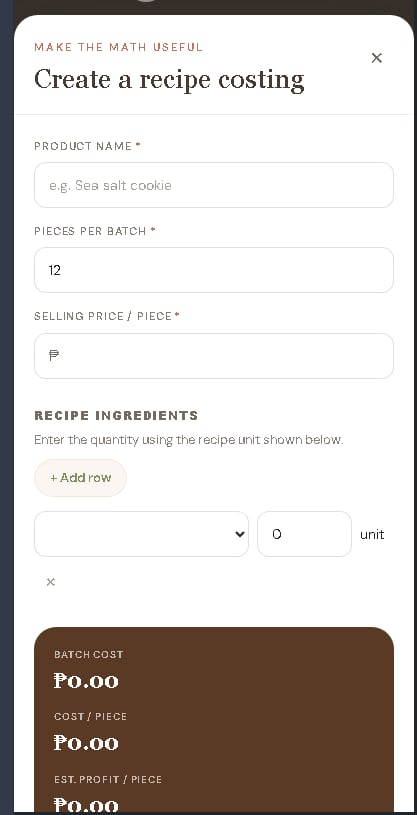

# CrumbCount Mockup

These mockups show the main CrumbCount screens and forms. The app uses a warm
brown and cream colour palette, clear stock and costing information, and simple
forms for entering bakery data.

## Overview

## Inventory

## Recipe costing

## Add an ingredient

## Create a recipe costing

## Phone view

### Overview

### Inventory

### Recipe costing

### Add an ingredient

### Create a recipe costing

