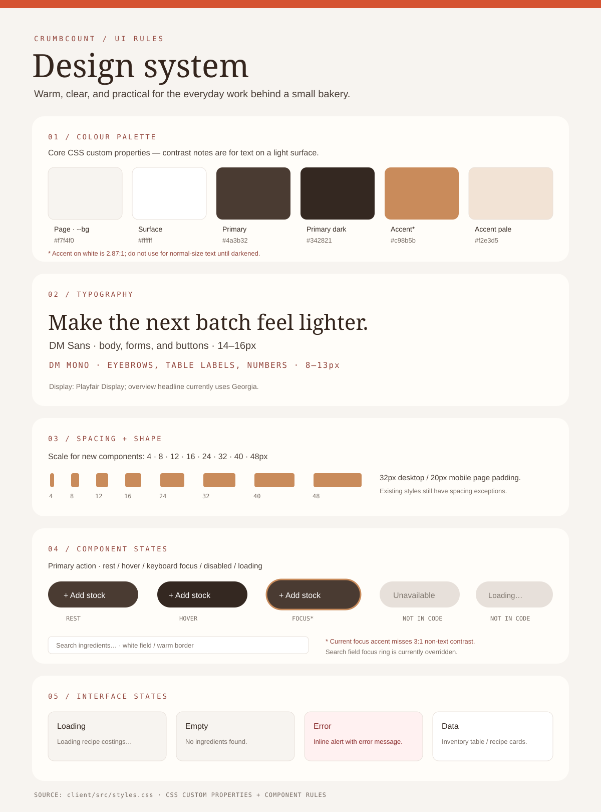

# Design system

CrumbCount uses a warm brown and cream style to match a small bakery.

## Colours

| Name | Colour |
| --- | --- |
| Page background | `#f7f4f0` |
| Cards and forms | `#ffffff` |
| Brown | `#4a3b32` |
| Dark brown | `#342821` |
| Accent | `#c98b5b` |
| Light accent | `#f2e3d5` |
| Main text | `#222222` |
| Muted text | `#817970` |

These colours are set as CSS variables in `client/src/styles.css`. Some accent
and muted text colours need more contrast on white, so they should be darkened
when used for important text.

## Type and spacing

- **DM Sans** for body text and forms.
- **Playfair Display** for headings.
- **DM Mono** for small labels and numbers.
- Use spacing in steps of 4, 8, 12, 16, 24, 32, 40, or 48 pixels.
- Page padding is 32px on desktop and 20px on mobile.

## Components and states

Buttons darken on hover, and keyboard focus uses an outline. Fields have a
white background and a light border. The app has loading, empty, error, and
data states; examples are shown in the visual sheet. Disabled and loading
button styles still need to be added.
